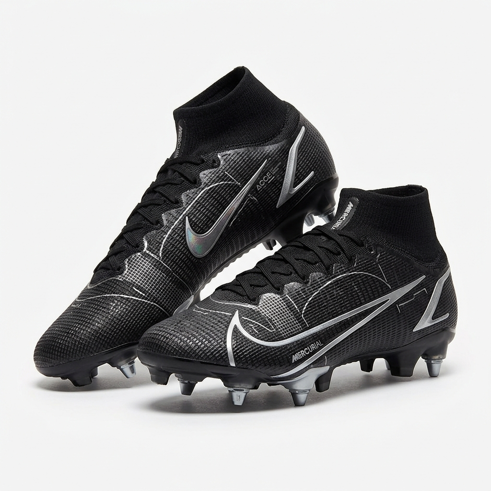
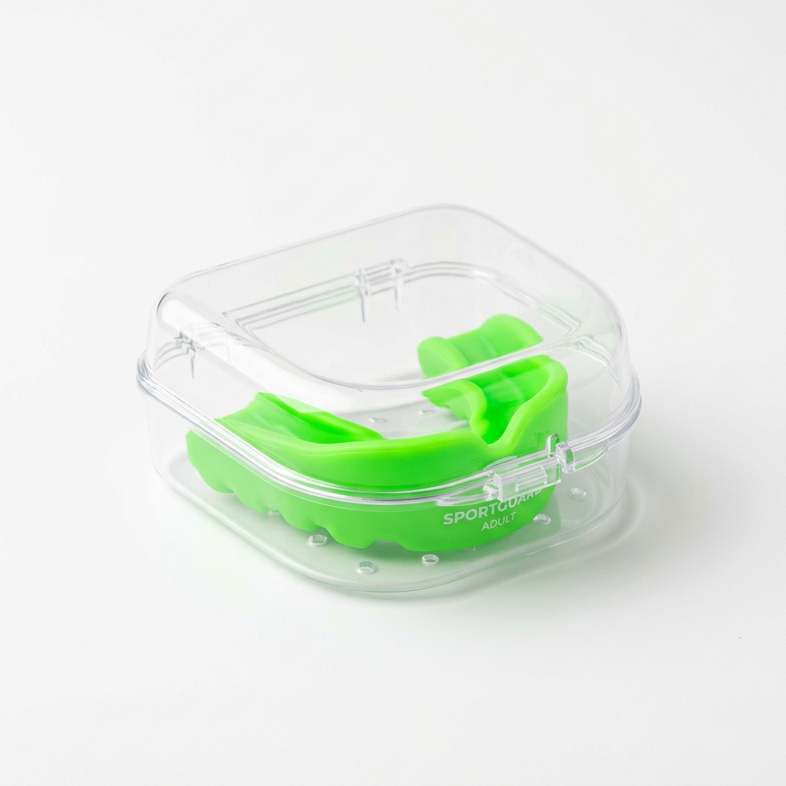

# RugbyStore E-Commerce Demo

A traditional, high-density e-commerce storefront designed specifically for rugby sports equipment, replica clothing, and protective gear. 


## 🌟 Overview

This project is a fully functional mock e-commerce storefront. It features standard retail paradigms like promotional banners, a prominent search-centric header, category routing, and an interactive shopping flow.

### Key Features
*   **Interactive Shopping Cart:** Clicking "Add to Basket" slides open a beautiful side-drawer displaying your cart items, calculating totals, and allowing item removal.
*   **Wishlist Functionality:** Hover over any product card and click the Heart icon to save it to your wishlist. Includes dynamic color toggling and toast notifications.
*   **Account Modal:** A sleek, screen-darkening overlay form for users to register or log in, accessible directly from the navigation bar.
*   **Category Navigation:** Clicking categories like "Boots" or "Replica" instantly updates the view to show only relevant products—acting like a real multi-page application.
*   **Custom AI Imagery:** The store is populated with 14 distinct, high-resolution AI-generated product images to ensure a premium, unbroken visual experience.

## 📸 Store Previews

| Premium Boots | Protective Gear | Match Equipment |
| :---: | :---: | :---: |
|  |  |  |

## 🛠 Tech Stack

*   **Frontend:** React 19 + Vite
*   **Styling:** Tailwind CSS v4
*   **Icons:** Lucide React
*   **Data Structure:** JSON-based mock backend (`products.json`)
*   **State Management:** Complex React `useState` for Cart, Wishlist, Categories, and Modals.

## 📁 Project Structure

```text
apple-showcase/
├── public/
│   └── images/             # 14 Custom Generated AI Product Images
├── src/
│   ├── components/
│   │   ├── Navbar.jsx      # Header, navigation, and category triggers
│   │   ├── Hero.jsx        # Top promotional banner
│   │   ├── Brands.jsx      # Top brands text carousel
│   │   ├── ProductCollection.jsx # Filterable product grid
│   │   ├── ProductCard.jsx # Product display with Cart & Wishlist logic
│   │   ├── BasketDrawer.jsx # Sliding shopping cart panel
│   │   ├── AccountModal.jsx # Popup login/registration form
│   │   └── Footer.jsx      # Comprehensive e-commerce footer
│   ├── data/
│   │   └── products.json   # 14 distinct e-commerce products
│   ├── App.jsx             # Main application layout & State manager
│   ├── index.css           # Global styles
│   └── main.jsx            # React entry point
└── README.md
```

## 🚀 Getting Started

1.  **Install dependencies:** `npm install`
2.  **Start the development server:** `npm run dev`
3.  **View the application:** Open `http://localhost:5173`

## Screenshot of a application

**Home Page**
<p align="center">
   
</p>

**list of items**
<p align="center">
   
</p>

**category items list**

<p align="center">
   
</p>


**add to card function**

<p align="center">
   
</p>

**create a account of user**

<p align="center">
   
</p>

## Browser Testing

This application was validated using [TestGrid.io](https://testgrid.io) to verify UI behavior and functionality across browser environments.

Testing coverage included:

- Navigation and category routing validation
- Product collection rendering
- Shopping cart interactions
- Wishlist functionality
- Account modal workflows
- Responsive UI behavior
- Product filtering and browsing experience
- General interaction and user flow verification

Using TestGrid helped ensure a consistent browsing experience and reliable functionality across supported browsers.
